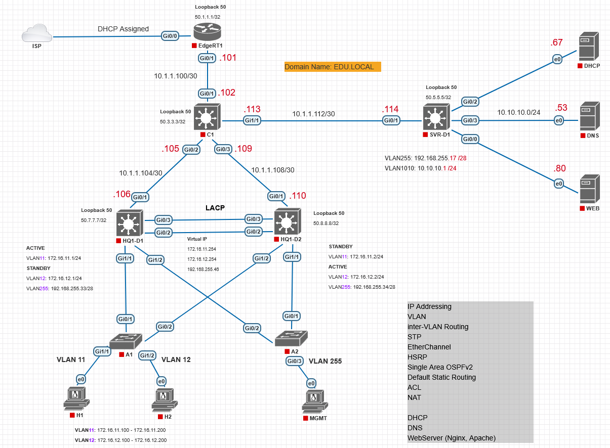

# DHCP Server on Debian12

### Тақырыбы: Debian Linux дистрибутивінде DHCP-ды конфигурациялау
### Жұмыстың орындалу қадамы: 
  1) DHCP-ды орнату;
  2) DHCP-ды конфигурациялау;
  3) Нәтижені тексеру.

### Корпоративті желінің топологиясы


### DHCP-ды орнату
```shell
$ sudo apt update
$ sudo apt upgrade -y
```
```shell
$ sudo apt install -y isc-dhcp-server
```

### DHCP-ды конфигурациялау
```shell
$ ip address
```
```shell
$ sudo nano /etc/default/isc-dhcp-server
INTERFACESv4="ens3"
INTERFACESv6=""
```
